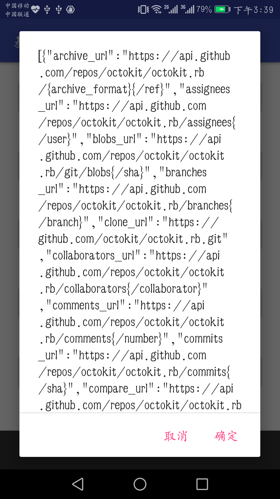
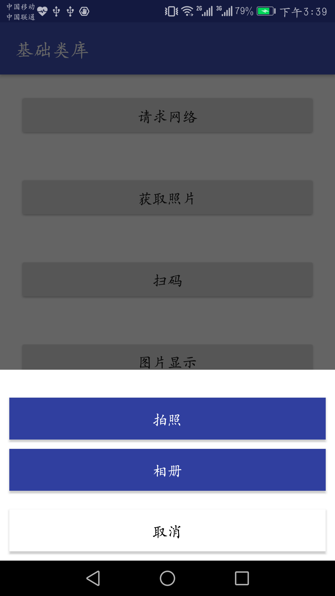

# basic-start-frame
## Android开发的基础功能集成，具有图片加载，通用列表适配器，基础mvp结构，网络请求，扫码等，可作为app新开发的初始框架，用来快速开发app
***
### 该项目具有两个类库，一个baselibrary，一个photolibrary
### 在你的项目root 的build.gradle 增加repositories
    allprojects {
        repositories {
    			...
                maven { url 'https://jitpack.io' }
            }
    }
    

1. baselibrary

    > dependencies {compile 'com.github.jixiangxiang.basic-start-frame:baselibrary:1.0.2'}
    ###### 本类库主要包含app开发的基础功能，基础的mvp框架的封装，基础的弹框，加载框封装，列表的数据适配器，通用的holder封装，retrofit+okhttp+rxjava的封装，和一些通用的工具类的封装等。
    #### 网络加载
    
    #### 图片选择
    
    #### 二维码扫描
    
    #### 基础mvp
    
2. photolibrary

    >dependencies { compile 'com.github.jixiangxiang.basic-start-frame:photolibrary:1.0.2'}
    
    ###### 本类库主要包含图片选择包含拍照选择和相册选择，裁剪，图片加载，默认集成的glide，二维码扫描（使用的bga-qrcodecore和bga-zxing），图片显示放大缩小，
    