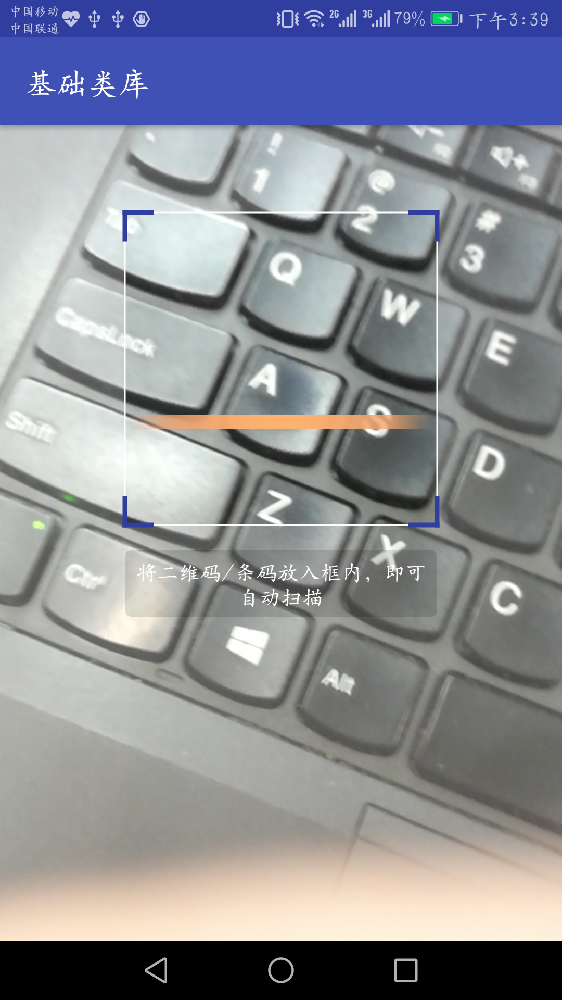

# basic-start-frame
## Android开发的基础功能集成，具有图片加载，通用列表适配器，基础mvp结构，网络请求，扫码等，可作为app新开发的初始框架，用来快速开发app
***
### 该项目具有两个类库，一个baselibrary，一个photolibrary
### 在你的项目root 的build.gradle 增加repositories
    allprojects {
        repositories {
    			...
                maven { url 'https://jitpack.io' }
            }
    }
    

1. ### baselibrary

    > dependencies {compile 'com.github.jixiangxiang.basic-start-frame:baselibrary:1.0.2'}
##### 本类库主要包含app开发的基础功能，基础的mvp框架的封装，基础的弹框，加载框封装，列表的数据适配器，通用的holder封装，retrofit+okhttp+rxjava的封装，和一些通用的工具类的封装等。
#### 网络加载
    GitHubService gitHubService = RetrofitManager.newInstance(SampleListActivity.this).getService(GitHubService.class);
                final ProgressDialog progressDialog = ProgressDialogUtil.createProgressDialog(SampleListActivity.this);
                gitHubService.getOctokitRepos()
                        .subscribeOn(Schedulers.io())
                        .observeOn(AndroidSchedulers.mainThread())
                        .doOnSubscribe(new Action0() {
                            @Override
                            public void call() {
                                progressDialog.show();
                            }
                        })
                        .subscribe(new Subscriber<JSONArray>() {
                            @Override
                            public void onCompleted() {
                                progressDialog.dismiss();
                            }
    
                            @Override
                            public void onError(Throwable throwable) {
                                SnackbarUtil.showLong(throwable.getMessage(), netBtn);
                            }
    
                            @Override
                            public void onNext(final JSONArray jsonArray) {
                                AlertDialogUtil.showConfirm(SampleListActivity.this, null, jsonArray.toJSONString(), "确定", new DialogInterface.OnClickListener() {
                                    @Override
                                    public void onClick(DialogInterface dialogInterface, int i) {
                                        SnackbarUtil.showLong("====" + i, netBtn);
                                    }
                                }, "取消", new DialogInterface.OnClickListener() {
                                    @Override
                                    public void onClick(DialogInterface dialogInterface, int i) {
                                        SnackbarUtil.showLong("====" + i, netBtn);
                                    }
                                });
    
                            }
                        });
##### 使用retrofit+rxjava+okhttp 实现的网络请求

    
#### 基础mvp
##### app项目中的MvpActivity展示了封装的mvp基础用法，整个列表页代码很简洁，只有五十几行

    
2. ### photolibrary

    >dependencies { compile 'com.github.jixiangxiang.basic-start-frame:photolibrary:1.0.2'}
    
##### 本类库主要包含图片选择包含拍照选择和相册选择，裁剪，图片加载，默认集成的glide，二维码扫描（使用的bga-qrcodecore和bga-zxing），图片显示放大缩小，
#### 图片选择
    int permission = ContextCompat.checkSelfPermission(this, Manifest.permission.WRITE_EXTERNAL_STORAGE);
                if (permission != PackageManager.PERMISSION_GRANTED) {
                    ActivityCompat.requestPermissions(this, new String[]{Manifest.permission.WRITE_EXTERNAL_STORAGE}, DialogUtil.PERMISSION_HEAD);
                } else {
                    if (dialogUtil == null || !dialogUtil.isShowing()) {
                        dialogUtil = DialogUtil.newInstance(this).authorities("com.eric.self.selfapplication.fileprovider");
                        dialogUtil.showDialog(DialogUtil.CHOOSE_PHOTO_DIALOG);
                    }
##### 包含了动态权限申请的代码，封装了dialogUtil来使用图片选择功能

     
#### 二维码扫描
##### 参考app项目中的ScanActivity类中的实现

     
#### 图片加载显示
##### 参考ListImageActivity的实现，图片加载使用的glide

